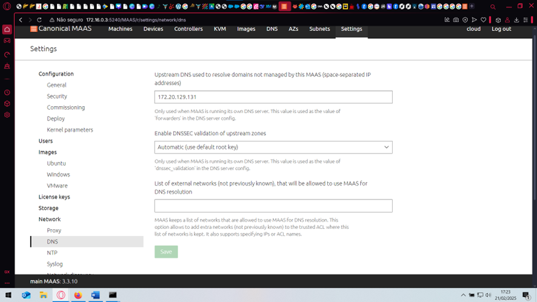

# Roteiro 1
## Objetivo
- Entender os conceitos básicos sobre uma plataforma de gerenciamento de hardware.
- Introduzir conceitos básicos sobre redes de computadores.
## Montagem do roteiro
### Tarefa 1: Instalar o MaaS
O MaaS um software de código aberto e suportado pela Canonical. O MAAS trata servidores físicos como máquinas virtuais ou instâncias na nuvem. 
Esse software possui diversas versões, mas para esse projeto iremos utilizar a versão stable 3.5.3.

Primeiro atualizamos os pacotes do sistema:

```sudo apt update && sudo apt upgrade -y```
   
Em seguida fazemos a instalação:

```
sudo snap install maas --channel=3.5/stable
sudo snap install maas-test-db
```

### Tarefa 2: Acessando e configurando o MaaS
Ainda conectado a máquina local pelo cabo Ethernet podemos acessar a máquina main através da nossa máquina pessoal utilizando o SSH:

```
ssh cloud@172.16.0.3
```


- Inicializando o MaaS

```
sudo maas init region+rack --maas-url http://172.16.0.3:5240/MAAS --database-uri maas-test-db:///
sudo maas createadmin
```

Nessa parte devemos criar um login e uma senha. Pelo padrão da disciplina iremos criar o admin como "cloud" e a senha "cloud"+"letra do Kit", neste caso "cloudv"


- Gerando o par de chaves para autenticação
  
Em seguida, precisamos gerar as chaves para autenticar através do comando:

```
ssh-keygen -t rsa
```


Gerando a chave, devemos copiar e guardar em uma pasta: 


```
cat ./.ssh/id_rsa.pub
```

- Acessando o dashboard do MaaS

Após esses passos é possível acessar o dashboard do MaaS para dar sequência as outras configurações necessárias através do link [http://172.16.0.3:5240/MAAS](http://172.16.0.3:5240/MAAS)

Agora precisamos configurar o DNS forwarder com o DNS do Insper. Para isso precisamos acessar a aba Settings/Network/DNS do dashboard:



Agora vamos importar as imagens do Ubuntu 22 e 24 no dashboard.

Em seguida devemos definir o Global Kernel Parameters

### Tarefa 3: Chaveando o DHCP

Nessa etapa precisamos habilitar o DHCP no MaaS Controller, definindo o range de IPs iniciar em 172.16.11.1 e acabar em 172.16.14.255. Além disso, tem que deixar o DNS da subnet apontando para o DNS do Insper.


### Tarefa 4: Checando a saúde do Maas

Dentro do dashboard, na aba de Controladores, é possível checar a "saúde" do sistema Maas. Nessa página deve haver uma marca de seleção verde ao lado dos itens 'regiond' até 'dhcpd':

![(imagens/imagem_2025-03-13_025825254.png)]
