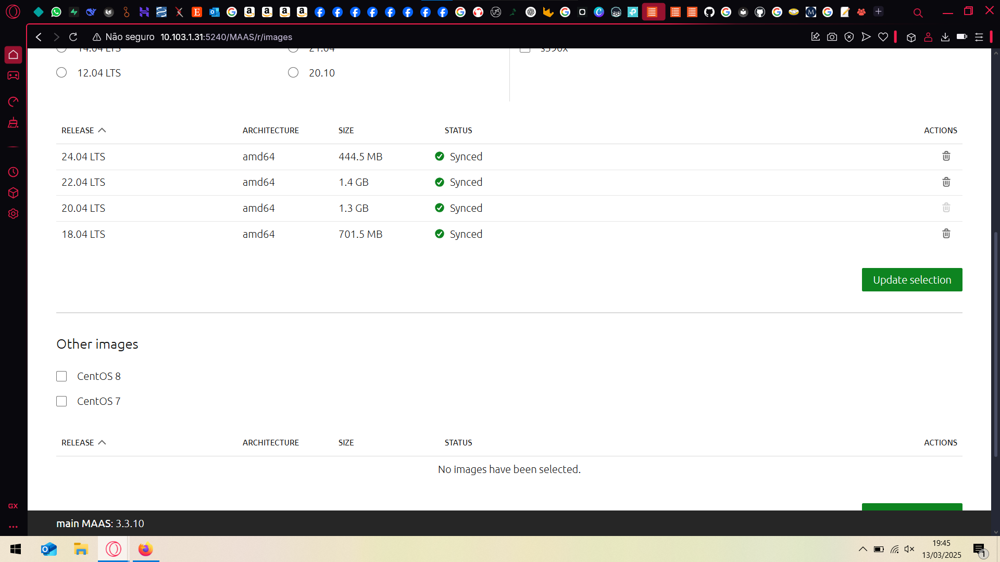
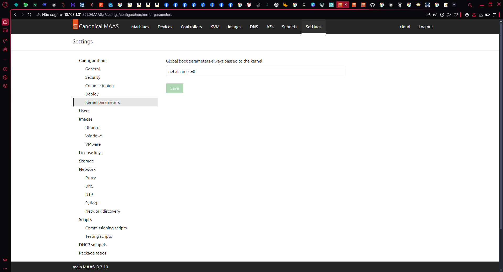
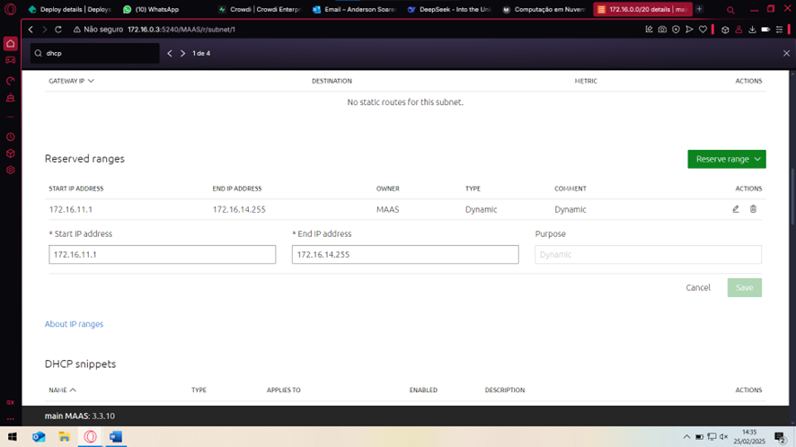
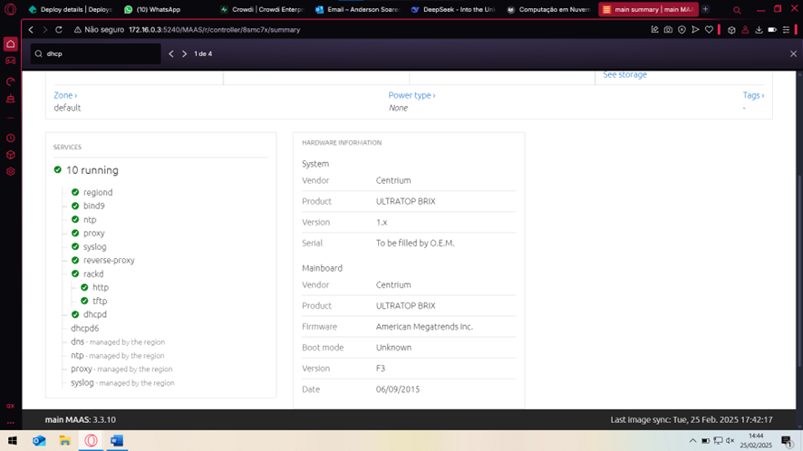
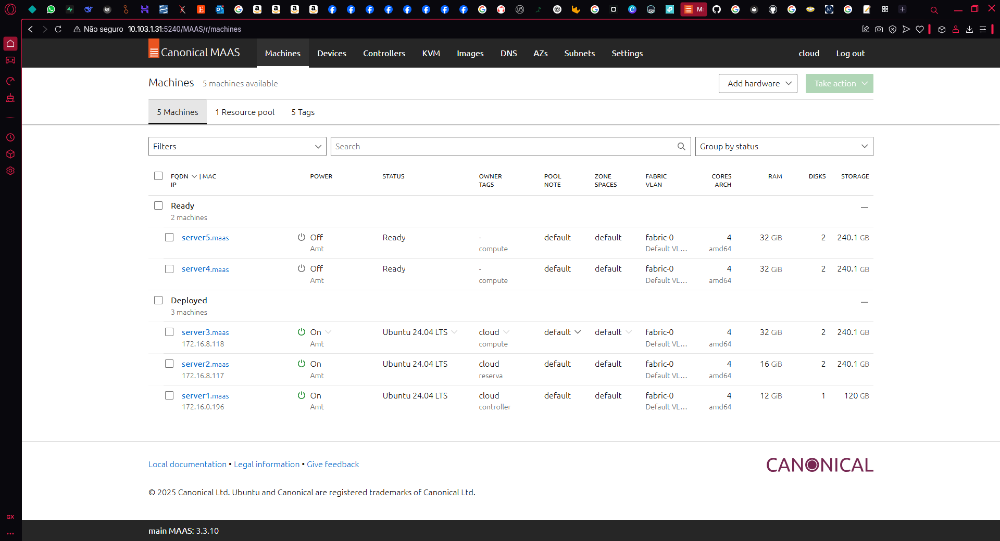
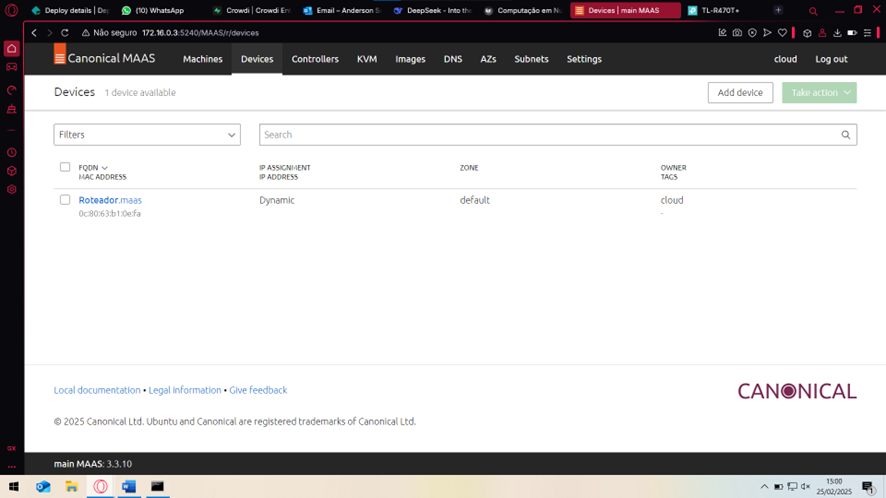
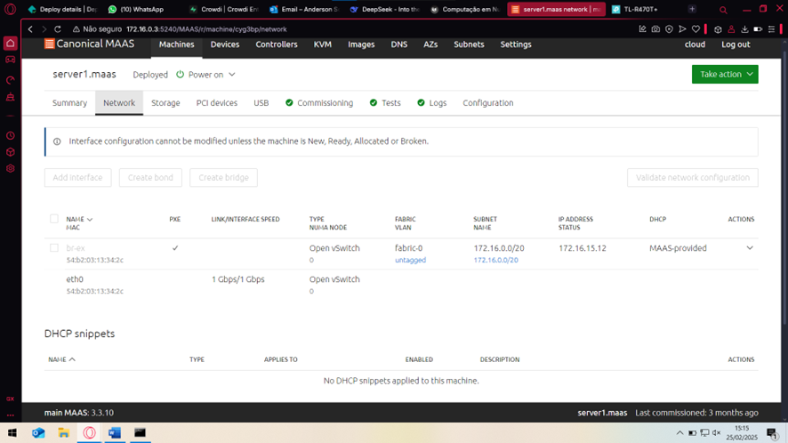
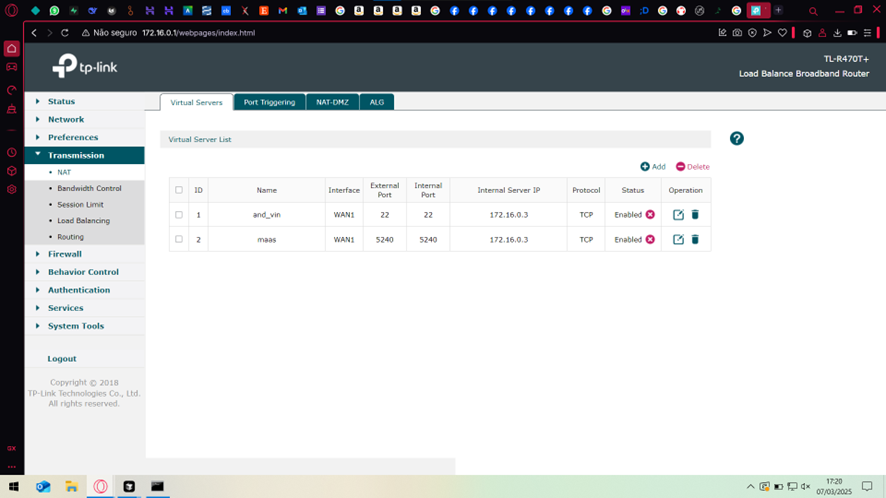
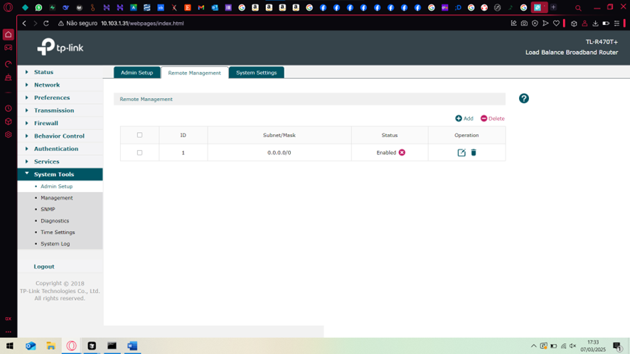

# Roteiro 1
## Objetivo
- Entender os conceitos básicos sobre uma plataforma de gerenciamento de hardware.
- Introduzir conceitos básicos sobre redes de computadores.
## Montagem do roteiro
### Tarefa 1: Instalar o MaaS
O MaaS um software de código aberto e suportado pela Canonical. O MAAS trata servidores físicos como máquinas virtuais ou instâncias na nuvem. 
Esse software possui diversas versões, mas para esse projeto iremos utilizar a versão stable 3.5.3.

Primeiro atualizamos os pacotes do sistema:

```sudo apt update && sudo apt upgrade -y```
   
Em seguida fazemos a instalação:

```
sudo snap install maas --channel=3.5/stable
sudo snap install maas-test-db
```

### Tarefa 2: Acessando e configurando o MaaS
Ainda conectado a máquina local pelo cabo Ethernet podemos acessar a máquina main através da nossa máquina pessoal utilizando o SSH:

```
ssh cloud@172.16.0.3
```


- Inicializando o MaaS

```
sudo maas init region+rack --maas-url http://172.16.0.3:5240/MAAS --database-uri maas-test-db:///
sudo maas createadmin
```

Nessa parte devemos criar um login e uma senha. Pelo padrão da disciplina iremos criar o admin como "cloud" e a senha "cloud"+"letra do Kit", neste caso "cloudv"


- Gerando o par de chaves para autenticação
  
Em seguida, precisamos gerar as chaves para autenticar através do comando:

```
ssh-keygen -t rsa
```


Gerando a chave, devemos copiar e guardar em uma pasta: 


```
cat ./.ssh/id_rsa.pub
```

- Acessando o dashboard do MaaS

Após esses passos é possível acessar o dashboard do MaaS para dar sequência as outras configurações necessárias através do link [http://172.16.0.3:5240/MAAS](http://172.16.0.3:5240/MAAS)

Agora precisamos configurar o DNS forwarder com o DNS do Insper. Para isso precisamos acessar a aba Settings/Network/DNS do dashboard:


Agora vamos importar as imagens do Ubuntu 22 e 24 no dashboard:



Em seguida devemos definir o Global Kernel Parameters:



### Tarefa 3: Chaveando o DHCP

Nessa etapa precisamos habilitar o DHCP no MaaS Controller, definindo o range de IPs iniciar em 172.16.11.1 e acabar em 172.16.14.255. Além disso, tem que deixar o DNS da subnet apontando para o DNS do Insper.




### Tarefa 4: Checando a saúde do Maas

Dentro do dashboard, na aba de Controladores, é possível checar a "saúde" do sistema Maas. Nessa página deve haver uma marca de seleção verde ao lado dos itens 'regiond' até 'dhcpd':



### Tarefa 5: Comissionando os servidores

Agora é o momento de cadastrar (fazer o host) de todas as máquinas do server1 até o server5 através da aba Machines do dashboard do MaaS. Para isso algumas instruções devem ser seguidas:

- Ao cadastrar as máquinas devemos preencher as opções:
   - Preencher a opção Power Type com Intel AMT
   - Inserir MacAddress da máquina respectiva, esse valor está escrito em cada máquina na parte de baixo
   - Inserir a senha como _CloudComp6s!_
   - IP do AMT = 172.16.15.X (sendo X o id do server, por exemplo server1 = 172.16.15.1)

Em seguida, devemos checar todos os nós e verificar se estão todos com o status Ready, além de verificar também o hardware como memória, SSD etc.



Ainda resta um último dispositivo para cadastrar, neste caso o roteador. Adicionamos o roteador pela aba Devices do dashboard do MaaS:



### Tarefa 5: Criando OVS bridge

Uma Open vSwitch (OVS) bridge reduz a necessidade de duas interfaces de rede físicas. As pontes OVS são criadas na aba NetWork ao configurar um nó (machine). Aqui, vamos criar uma ponte a partir da interface regular 'eth0'. O nome da ponte vai ser referenciado em outras partes e como exigência da disciplina iremos chamar de 'br-ex':



Devemos fazer esse procedimento para cada uma das machines da nossa nuvem.

### Tarefa 6: Fazendo acesso remoto ao kit

Agora vamos realizar um NAT para permitir o acesso externo "Rede Wi-fi Insper" do computador pessoal ao servidor MAIN, a ideia é utilizar a porta 22. Além disso, temos que configurar uma porta para acessar o MaaS remotamente, usaremos a porta 5240 e configurar no roteador na aba Transmisson -> NAT:



Também é necessário liberar o acesso ao gerenciamento remoto do roteador criando uma regra de gestão para a rede 0.0.0.0/0, na aba System Tools -> Admin Setup -> Remote Management:



Assim já é possível acessar remotamente sem precisar conectar o cabo Ethernet diretamente no Switch. Neste caso, precisamos utilizar um IP diferente disponível no dashboard do roteador na página principal em WAN IPv4 -> WAN1 -> IP Address
